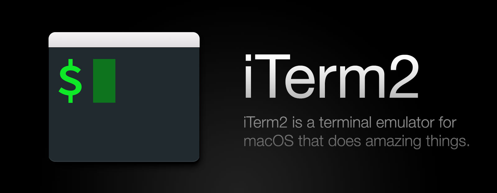
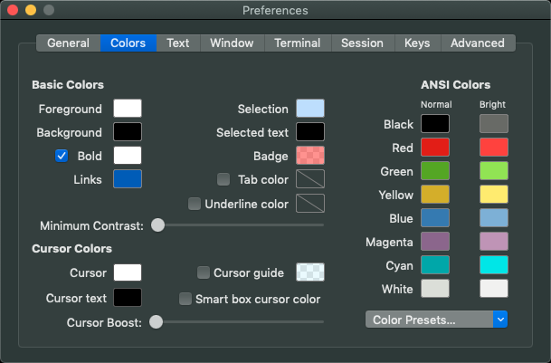
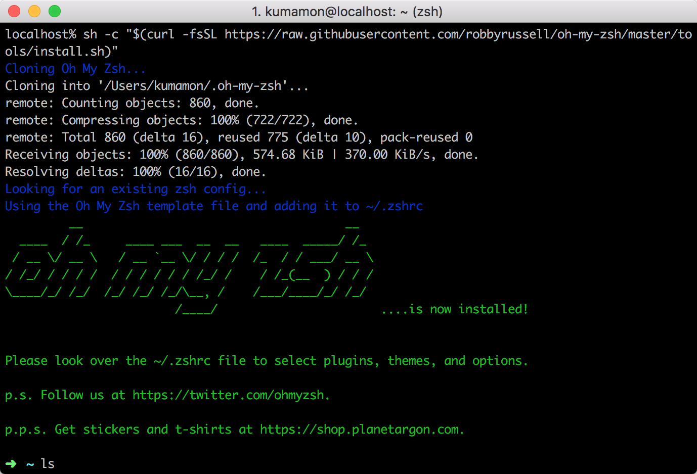
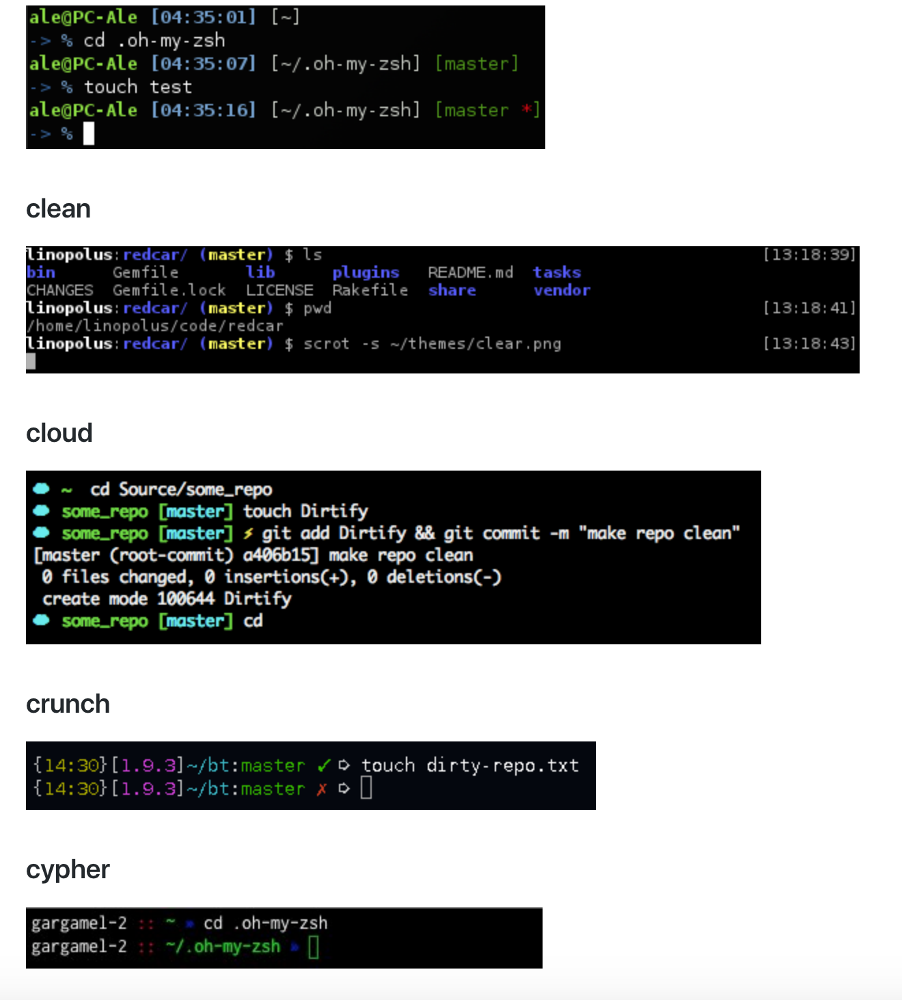
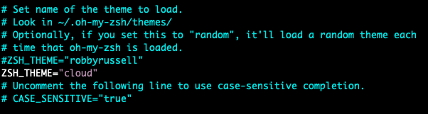

# Mac必备开发神器
下面介绍几款Mac下必备开发神器：iTerm2、Zsh(Ohmyzsh)、Homebrew、Alfred。

# 1、iTerm2


### 1.1、iTerm2的介绍与安装
iTerm2是iTerm的替代品，也是iTerm的继承者。 它适用于使用macOS 10.10或更高版本的Mac。 iTerm2将iTerm带入了您从未想过的功能的现代时代。

官网的下载地址[在这里](https://www.iterm2.com/)，下载完成后直接点击就可以安装了。

### 1.2、iTerm2常用快捷键

```
⌘+N、⌘+T、⌘+↔、⌘+F、⌘+W 这几个快捷键就不解释了。

⌘+D 垂直分屏、⌘+⇧+D 水平分屏、⌘+⌥+↑↓↔ 切换分屏。

⌘+↩全屏、⌘ + R 清屏。

⌃+A/E 行首/尾、⌃+R 查询历史命令。

⌥+↔ 左右跳过单词。
```

记住这些就差不多了，脑容量有限，应能省则省。

### 1.3、iTerm2配色方案
主题地址[在这里](https://iterm2colorschemes.com/)，然后选择一个你认为很好看的颜色主题并下载。

有两种方法可以安装iTerm主题：

**直接通过键盘快捷方式：**

* 输入CMD + i（⌘+ i）
* 导航到“颜色”选项卡
* 单击“颜色预设”
* 单击“导入”
* 选择您要使用的方案的.itermcolors文件
* 单击“颜色预设”并选择颜色方案

**通过iTerm偏好**

* 点击iTerm2菜单标题
* 选择首选项...选项
* 选择配置文件
* 导航到“颜色”选项卡
* 单击“颜色预设”
* 单击“导入”
* 选择您要使用的方案的.itermcolors文件
* 单击“颜色预设”并选择颜色方案



# 2、Zsh(Ohmyzsh)

### 2.1、Zsh的介绍
Zsh 是一款功能强大终端（shell）软件，既可以作为一个交互式终端，也可以作为一个脚本解释器。它在兼容 Bash 的同时 (默认不兼容，除非设置成 emulate sh) 还有提供了很多改进，例如：

* 更高效
* 更好的自动补全
* 更好的文件名展开（通配符展开）
* 更好的数组处理
* 可定制性高

### 2.2、Ohmyzsh的介绍与安装


Ohmyzsh是一个令人愉快的，开源的，社区驱动的框架，用于管理Zsh配置。它捆绑了大量有用的功能，助手，插件，主题和一些让你尖叫的东西......

官网地址[在这里](https://ohmyz.sh/)，复制下面命令运行进行安装

```
sh -c "$(curl -fsSL https://raw.github.com/robbyrussell/oh-my-zsh/master/tools/install.sh)"
```



如果出现该画面说明你已经安装成功！

### 2.3、Ohmyzsh的主题安装



官方主题地址[在这里](https://github.com/robbyrussell/oh-my-zsh/wiki/Themes)，下面说说如何配置：

为了启用主题，在获取Oh My Zsh之前，将ZSH_THEME设置为〜/ .zshrc中主题的名称; 例如：ZSH_THEME = robbyrussell
如果您不想启用任何主题，只需将ZSH_THEME设置为空白：ZSH_THEME =“”




# 3、Homebrew


### 3.1、Homebrew的介绍与安装

官网地址[在这里](https://brew.sh/)，复制下面命令运行进行安装

```
/usr/bin/ruby -e "$(curl -fsSL https://raw.githubusercontent.com/Homebrew/install/master/install)"
```

### 3.2 Homebrew常用命令

```
brew search mysql #搜索指定软件

brew info mysql #查看软件的信息，比如目前的版本，依赖，安装后注意事项等

brew update #这会更新 Homebrew 自己，并且使得接下来的两个操作有意义——

brew outdated #检查过时（是否有新版本）这会列出所有安装的软件里可以升级的那些

brew upgrade #升级所有可以升级的软件们

brew cleanup #清理不需要的版本极其安装包缓存

brew outdated # 看一下哪些软件可以升级

brew upgrade <xxx> # 升级指定的：如果不是所有的都要升级，那就这样升级指定的
 
brew upgrade; brew cleanup #升级并清理：如果都要升级，直接升级完然后清理干净
```

# 4、Alfred


### 4.1、Alfred的介绍与安装

下载地址[在这里](https://www.alfredapp.com/)


# 10、引用
1. [Mac 小记 — iTerm2、Zsh、Homebrew](https://www.cnblogs.com/youclk/p/8125305.html)

2. [Mac 从零开始配置开发环境](https://www.codecasts.com/series/setup-a-mac-dev-machine)

3. [Zsh(简体中文)](https://wiki.archlinux.org/index.php/Zsh_(%E7%AE%80%E4%BD%93%E4%B8%AD%E6%96%87))